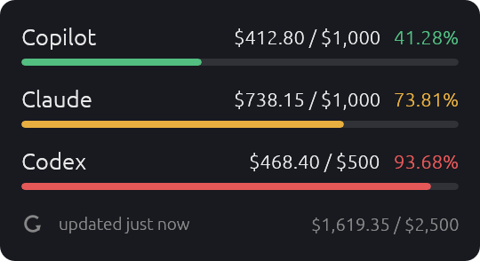
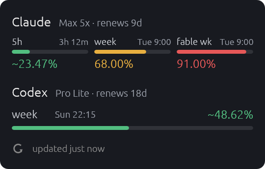

# usage-widget

Always-on-top widget for GitHub Copilot, Claude and Codex usage, plans and renewals.

| Dollar budgets | Plan usage windows |
| --- | --- |
|  |  |

## Install

Needs Rust. Built for Windows; runs on macOS without `--startup`.

```bash
cargo install --git https://github.com/pepsi-enjoyer/usage-widget
usage-widget --startup   # start at login; --no-startup undoes
usage-widget
```

Re-run `cargo install` and restart the widget to upgrade.

## Use

- Drag to move; position is remembered.
- Right-click: refresh, usage pages, edit config, quit (no taskbar entry).
- Click a service name to open its usage page.

## Config

`usage-widget config` creates and opens `config.toml` (in `$VISUAL`/`$EDITOR` if set):
`%APPDATA%\usage-widget\` on Windows, `~/Library/Application Support/usage-widget/` on
macOS. Restart the widget after editing.

```toml
refresh_mins = 5    # minutes between refreshes, minimum 1
opacity = 85        # window opacity, 20-100
precision = 1       # decimal places for percentages, 0-3

[copilot]
enabled = true      # false hides a service; same key under each

[claude]
enabled = true
api = true          # false = read Claude Code's cache only
browser_cookies = false  # macOS: read the claude.ai login cookie for the renewal date
estimate = false    # estimate between percentage ticks from local logs; shown with ~

[codex]
enabled = true
estimate = false    # as for Claude
```

## Credentials

Reuses the CLIs' stored credentials; never writes them.

| Service | Credential |
| --- | --- |
| Copilot | `gh auth token`, `GITHUB_TOKEN` or `GH_TOKEN` |
| Claude | `~/.claude/.credentials.json` (macOS: keychain) |
| Codex | `~/.codex/auth.json` |

Run `claude` or `codex` to refresh expired tokens. API endpoints are undocumented.

### Claude Code status line

For live Claude 5-hour and weekly usage, the widget needs your Claude Code status
line to save its input. Add these lines to the start of your status line script,
then use `$INPUT` wherever the script previously read stdin:

```bash
INPUT=$(cat)
case "$INPUT" in *'"five_hour"'*) printf '%s' "$INPUT" > ~/.claude/usage-widget-statusline.json;; esac
```

This updates usage as you use Claude Code, without extra requests. Without it,
the widget uses cached data and polls at most every 15 minutes, subject to rate limits.

Estimates only cover local logs; Claude needs a few percentage ticks to calibrate.
Optional Claude renewal cookies come from Chrome, Arc, Brave or Edge on macOS,
with a keychain access prompt on first use. Dollar rates: `src/providers.rs`.
